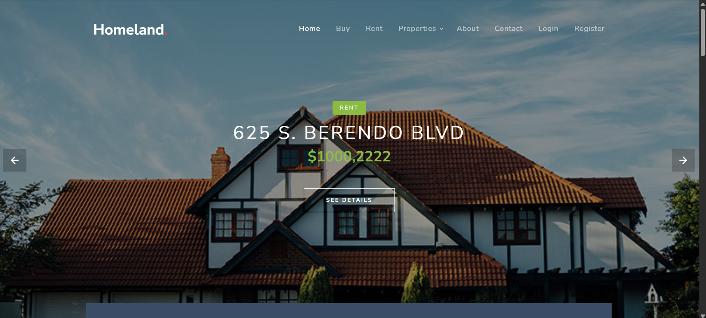
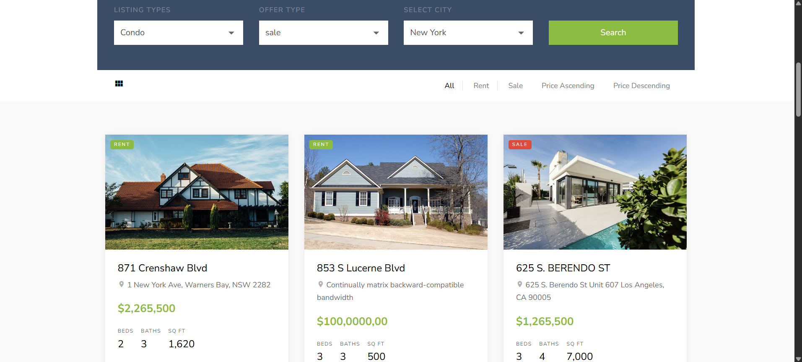

🏠 Homeland: Real Estate Listing Platform
  Homeland is a PHP-based real estate listing platform that enables users to browse, search, and view property details. The application includes user authentication, property categorization, and an admin panel 
  for efficient management.

    🚀 Features
    User Authentication: Secure login and registration system.
    
    Property Listings: Browse properties available for sale or rent with detailed descriptions.
    
    Search Functionality: Search properties based on various criteria.
    
    Admin Panel: Manage property listings, categories, and user information.
    
    Responsive Design: Optimized for desktops, tablets, and mobile devices.
    
    Contact Page: Dedicated page for user inquiries.

🛠️ Tech Stack

    Frontend: HTML5, SCSS/CSS3, JavaScript
    Backend: PHP
    Database: MySQL
    Version Control: Git

📁 Project Structure

plaintext
Copy
Edit

    
    homeland--real-estate/
    ├── admin-panel/       # Admin dashboard and management tools
    ├── auth/              # User authentication scripts
    ├── categories/        # Property categories
    ├── config/            # Database configuration files
    ├── css/               # Stylesheets
    ├── favs/              # Favorite properties functionality
    ├── fonts/             # Font files
    ├── images/            # Image assets
    ├── includes/          # Reusable PHP components (e.g., header, footer)
    ├── js/                # JavaScript files
    ├── requests/          # Request handling scripts
    ├── scss/              # SCSS files
    ├── user/              # User profile and account management
    ├── 404.php            # Custom 404 error page
    ├── about.php          # About us page
    ├── contact.php        # Contact information and form
    ├── index.php          # Homepage
    ├── price.php          # Price range filtering
    ├── property-details.php # Detailed property view
    ├── rent.php           # Properties for rent
    ├── sale.php           # Properties for sale
    ├── search.php         # Search results page
    └── README.md          # Project documentation
## 📸 Screenshots

### 🏠 Home Page  

### 🔐 Login Page  

### 📝 Register Page  

### ℹ️ About Page  

### 📞 Contact Page  

### 👤 Profile  

### ⚙️ Admin Dashboard  

⚙️ Getting Started
Prerequisites

    PHP 7.x or higher
    
    MySQL or compatible database
    
    Web server (e.g., Apache, Nginx)

Installation
Clone the Repository

    bash
    Copy
    Edit
    git clone https://github.com/bhaktofmahakal/homeland--real-estate.git
Set Up the Database

    Create a new MySQL database named homeland.
    
    Import the provided SQL file (if available) to set up the necessary tables and data.

Configure Database Connection

Navigate to the config/ directory.

Open the database configuration file (e.g., config.php) and update the database credentials:

php
Copy
Edit

    define('DB_SERVER', 'localhost');
    define('DB_USERNAME', 'your_username');
    define('DB_PASSWORD', 'your_password');
    define('DB_NAME', 'homeland');
Deploy the Application:

Place the project folder in your web server's root directory (e.g., htdocs for XAMPP).

Start your web server and navigate to http://localhost/homeland--real-estate/ in your browser.

📸 Screenshots
Include screenshots of the homepage, property listings, property details page, and admin panel here.

🤝 Contributing
Contributions are welcome! To contribute:

Fork the repository.

Create a new branch:

    bash
    Copy
    Edit
    git checkout -b feature/YourFeature
Commit your changes:

    bash
    Copy
    Edit
    git commit -m "Add YourFeature"
Push to the branch:

    bash
    Copy
    Edit
    git push origin feature/YourFeature
Open a pull request describing your changes.

📄 License
This project is licensed under the MIT License.

📬 Contact

    For any inquiries or feedback, please contact utsavmishraa005@gmail.com

