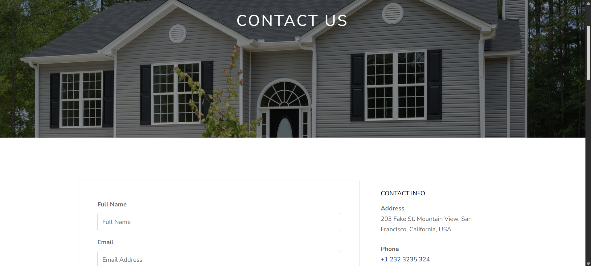
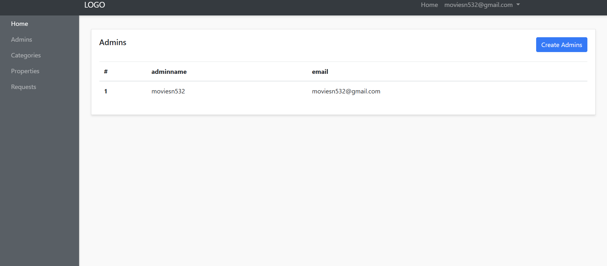

# 🏠 Homeland: Real Estate Listing Platform

**Homeland** is a feature-rich PHP-based web application for real estate listings. It empowers users to explore, search, and book properties, while enabling admins to manage listings through a powerful control panel.

  
  
  
  

---

## 🚀 Features

- 🔐 **User Authentication**: Secure sign-up and login system.
- 🏘️ **Property Listings**: View detailed properties for sale and rent.
- 🔎 **Smart Search**: Filter properties by type, price, or keywords.
- 🧑‍💼 **Admin Panel**: Admins can manage listings, users, categories.
- 💖 **Favorites System**: Bookmark properties for quick access.
- 📞 **Contact Form**: Built-in support inquiry form.
- 📱 **Responsive Design**: Fully mobile & desktop friendly.

---

## 🧰 Tech Stack

| Layer       | Technology                        |
|-------------|------------------------------------|
| Frontend    | HTML5, SCSS, CSS3, JavaScript      |
| Backend     | PHP                                |
| Database    | MySQL                              |
| Versioning  | Git                                |

---

## 📁 Project Structure

Click to view

    homeland--real-estate/
    ├── admin-panel/             # Admin dashboard
    ├── auth/                    # Login/Register logic
    ├── categories/              # Property categories
    ├── config/                  # DB connection
    ├── css/                     # Compiled stylesheets
    ├── favs/                    # Favorites feature
    ├── fonts/                   # Font files
    ├── images/                  # UI images
    ├── includes/                # Header, footer, etc.
    ├── js/                      # JavaScript files
    ├── requests/                # API-style requests
    ├── scss/                    # Source styling
    ├── user/                    # User profile, bookings
    ├── 404.php                  # Custom error page
    ├── about.php                # About us
    ├── contact.php              # Contact form
    ├── index.php                # Homepage
    ├── price.php                # Price filtering logic
    ├── property-details.php     # Property detail view
    ├── rent.php                 # Rent listings
    ├── sale.php                 # Sale listings
    ├── search.php               # Search handler
    └── README.md                # Project documentation

---

## 📸 Project Screenshots

| Page/Section       | Screenshot                            | Description                                 |
|--------------------|----------------------------------------|---------------------------------------------|
| 🏠 Home Page        |                 | Main landing page for visitors              |
| ℹ️ About Page       |               | Project overview and purpose                |
| 📩 Contact Page     |           | User contact form for queries               |
| 🔐 Login Page       |               | Existing users can securely log in          |
| 📝 Register Page    |         | New user registration form                  |
| 🧾 Book Page        |                 | Form to book a service or item              |
| 📆 Booking Page     |           | Displays user's bookings                    |
| ⚙️ Admin Panel      |               | Admin dashboard for managing data           |
| 🛠️ Service Page     |           | Lists all available services                |

---

⚙️ Getting Started

✅ Prerequisites

        PHP 7.x or later
        
        MySQL Server
        
        Web Server (XAMPP/WAMP or Nginx)
        
        Git

🚀 Installation Steps

Clone the Repository

        git clone https://github.com/bhaktofmahakal/homeland--real-estate.git
        cd homeland--real-estate

Set Up the Database

        Create a new MySQL database named homeland
        
        Import the provided .sql file (if available)
        
        Configure DB Connection

In config/config.php, update:

        define('DB_SERVER', 'localhost');
        define('DB_USERNAME', 'your_username');
        define('DB_PASSWORD', 'your_password');
        define('DB_NAME', 'homeland');

Run the Application

        Move the project folder into your web root (e.g., htdocs for XAMPP)
        
        Start Apache and MySQL

Visit in browser:

        http://localhost/homeland--real-estate/

---

🤝 Contributing

We welcome contributions from developers!

How to Contribute:

# Fork the repo
        git checkout -b feature/YourFeature     # Create a new feature branch
        # Make your changes and commit
        git commit -m "Add YourFeature"
        git push origin feature/YourFeature     # Push changes
        # Open a pull request describing your contribution

---

📄 License

This project is licensed under the MIT License.

---

📬 Contact

Developer: Utsav Mishra

📧 Email: utsavmishraa005@gmail.com

🌐 GitHub: github.com/bhaktofmahakal

🔗 LinkedIn: linkedin.com/in/utsav-mishra1

